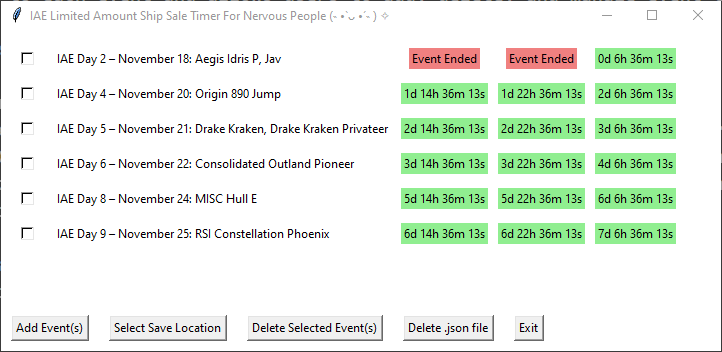

**IAE Limited Amount Ship Sale Timer For Nervous People (˵ •̀ ᴗ •́ ˵ ) ✧**

This Python application, built with Tkinter, is designed to help users keep track of limited-amount ship sale events. It displays a countdown to each event and allows users to add, delete, and manage event timers with ease.

**Features**
- Dynamic Event Timers: Countdowns to various ship sale events, updated in real-time.
- Add Events: Users can add new events through a simple interface.
- Save Event Data: Event timers are saved in a JSON file, which can be stored at a user-selected location.
- Delete Options: Users have the option to delete selected events or the entire event file.
- Customizable Save Location: Users can select the directory where the event data should be saved.
- User-Friendly Interface: Easy-to-use graphical interface for interaction.

**Installation**
To run this application, you need Python installed on your system. It uses the built-in Tkinter library, so no additional packages are required.

**Usage**
1. Starting the Application: Run the Python script to start the application.
2. Adding Events: Click on "Add Event(s)" and enter the event details in the format shown.
3. Selecting Save Location: Use the "Select Save Location" button to choose where your event data will be saved.
4. Deleting Events: Select events using the checkboxes and click "Delete Selected Event(s)" to remove them.
5. Deleting Event File: To remove all events and delete the saved file, click "Delete .json file".
6. Exiting the Application: Click "Exit" to close the application.

Paste into "Add Event(s)" for the 2023 Expo times/dates:

IAE Day 2 – November 18: Aegis Idris P, Jav <t:1700323200:F> // <t:1700352000:F> // <t:1700380800:F>

IAE Day 4 – November 20: Origin 890 Jump <t:1700496000:F> // <t:1700524800:F> // <t:1700553600:F>

IAE Day 5 – November 21: Drake Kraken, Drake Kraken Privateer <t:1700582400:F> // <t:1700611200:F> // <t:1700640000:F>

IAE Day 6 – November 22: Consolidated Outland Pioneer <t:1700668800:F> // <t:1700697600:F> // <t:1700726400:F>

IAE Day 8 – November 24: MISC Hull E <t:1700841600:F> // <t:1700870400:F> // <t:1700899200:F>

IAE Day 9 – November 25: RSI Constellation Phoenix <t:1700928000:F> // <t:1700956800:F> // <t:1700985600:F>
